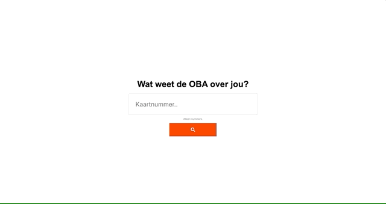

# Testen van OBA 
[Link naar mijn OBA project](https://github.com/gijslaarman/project-1-1920)

## Table of contents


## Testing on devices

### iPod touch (4th generation)
- Ios version: 6.0.1 (10A523)
- Browser: Safari 

```
Mozilla/5.0 (iPod; CPU iPhone OS 6_0_1 like Mac OS X) AppleWebKit/536.26 (KHTML, like Gecko) Version/6.0 Mobile/10A523 Safari/8536.25
```

#### Foundings
1. The CSS is fine, but I couldn't fully test if it worked since I never could see a detailpage.
1. Interaction did not work, the javascript didn't fire. There is a preventDefault set on the form submit, yet this does not work. 

#### Solution
There are two ways to fix the javascript not being used:
1. Use [Babel](https://babeljs.io/) to maybe fix the javascript and set it over to more browser compatibility.
2. _Better option_, Handle the submit server side, and return HTML.

### iPad 
- Ios version: 11.3
- Browser: Safari

```
Mozilla/5.0 (iPad; CPU OS 11_3 like Mac OS X) AppleWebKit/605.1.15 (KHTML, like Gecko) Version/11.0 Mobile/15E148 Safari/604.1
```

#### Foundings
1. It's a quite newish device
2. The javascript doesn't work: I know now it's because it's split up in modules which is terribly supported.

#### Solution

### Revolution (?) 
- Unknown android phone
- Android version: 4.4.4
- Browser: Revolution browser & Chrome browser

```
Mozilla/5.0 (Linux; Android 4.4.4; revolution Build/KTU84Q)AppleWebKit/537.36 (KHTML, like Gecko) Version/4.0 Chrome 33.0.0.0 Mobile Safari/537.35
```

#### Foundings
1. Same as the others 
1. Interaction did not work, the javascript didn't fire same problem. On Chrome it did work, probably up-to-date to support modules.

#### Solution
There are two ways to fix the javascript not being used:
1. Use [Babel](https://babeljs.io/) to minify and make the javascript into one file.

## Testing on browsers

### Chrome


### Firefox


### Brave
