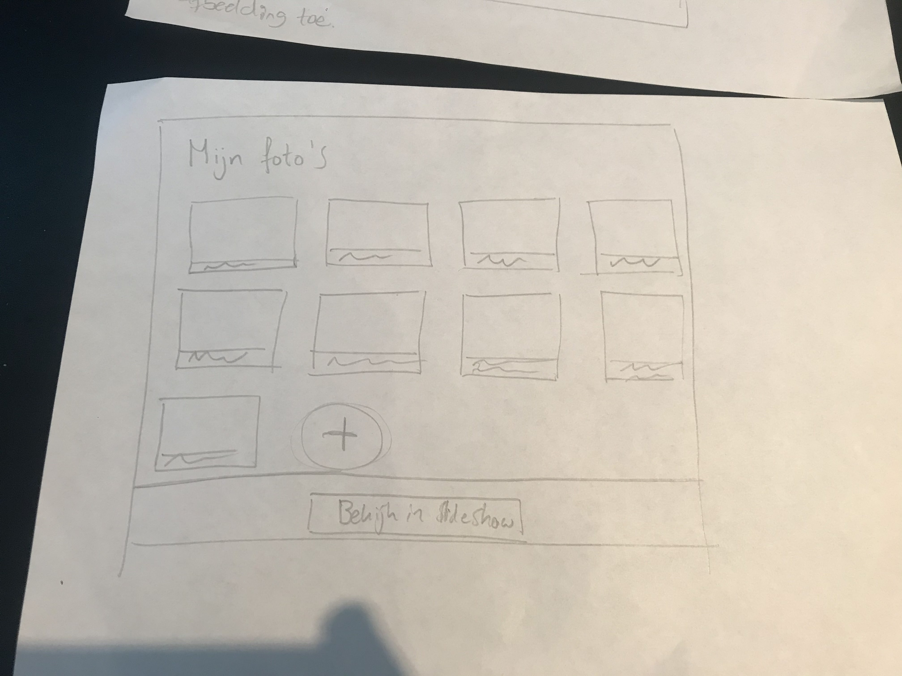
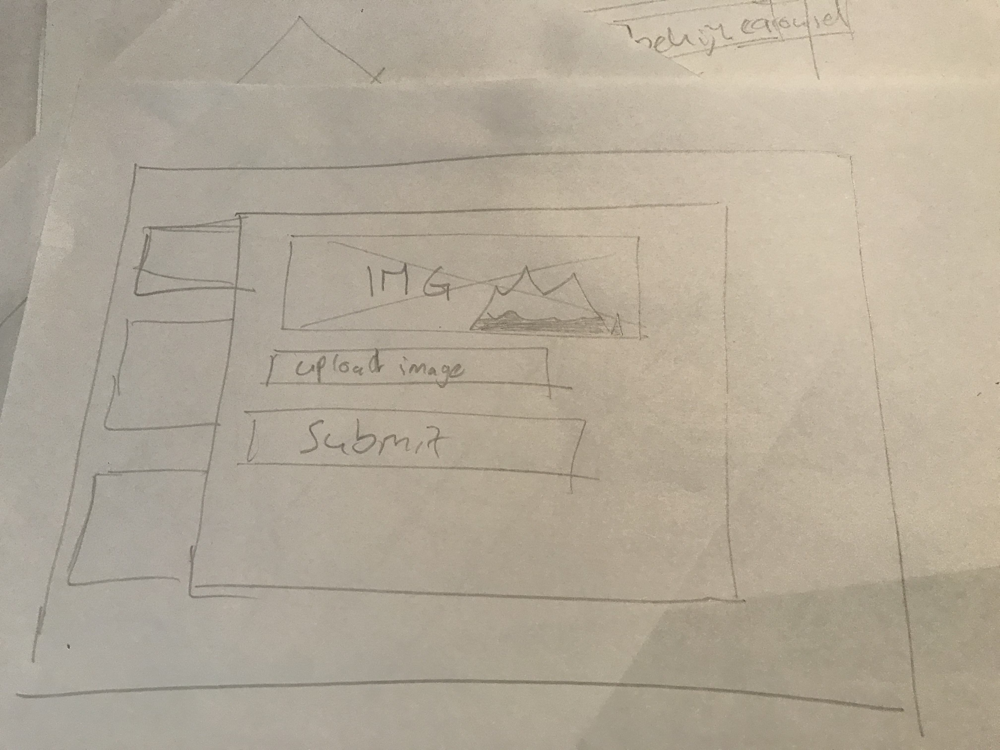
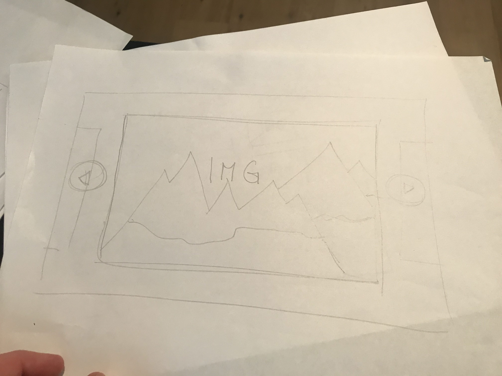

# Making an image carousel with progressive enhancement.
[Demo](bt.gijsbertcharles.com)

## Wireflows Lo-fi

## About this case
So for this case I had to do three things:
- Make a database to save the image data (such as the captions/alt text & filename). So I can keep track of the images.
- Upload the image to a folder.
- Render most of the content server side.

Now this is easily solved with [MongoDB](https://mongodb.com) & [Multer](https://www.npmjs.com/package/multer).
MongoDB to create an easy database that works seamlessly with Nodejs. And multer to handle the uploaded files to store them inside a folder on the server.

Rendering server side is not super hard to do, but combine it with all the dynamic features that have to be implemented provided a challenge.

I started with making it work in HTML. I was very quick to understand it, but then it came: I had to be able to make a selection of the images to showcase only those inside a carousel, yeh.. Thanks for that. 

So from making super rapid progression I have now halted to a standstill because everytime I think I have the solution the other feature breaks. So I keep yoyoing in between features.

<!-- ### Doel van deze opdracht
Het doel van deze opdracht is te leren hoe je een online functionaliteit zo kan maken met behulp van Progressive enhancement en Feature detectie dat deze het altijd doet ...

### Uitleg
Maak een demo op basis van een use case. Zorg dat alle gebruikers, met alle browsers, in iedere context minimaal de _core functionaliteit_ te zien/horen/voelen krijgen en maximaal een hele goede UX.

Bouw je demo in 3 lagen, volgens het principe van Progressive Enhancement.

Gebruik als enhancement een (innovatieve, vooruitstrevende, onbekende, nieuwe) [Browser Technologie](https://platform.html5.org) die je gaat onderzoeken op functionaliteit, toegankelijkheid en (browser) ondersteuning. Je onderzoekt hoe je verschillende features door verschillende browsers worden ondersteund en hoe je voor goede fallback kan zorgen. Test de features op verschillende browsers en het Device Lab. Polyfills en NPM is niet toegestaan.

Gebruik [html5test.com](https://html5test.com), [css3test.com](http://css3test.com) en [kangax.github.io/compat-table/es6/](https://kangax.github.io/compat-table/es6/)

### Werkwijze
Schets eerst een wireflow en/of breakdown-schets met hoe de demo moet gaan werken en hoe het eruit komt te zien. Bepaal de functional/reliable, usable en pleasurable laag.
- Onderzoek voor de functional/reliable laag naar semantische HTML elementen
- Kijk voor de usable laag naar design patterns die je zou kunnen toepassen
- De meest 'enhanced' versie is super vet, gaaf en h-e-l-e-maal te leuk om te gebruiken … Dit is de pleasurable laag.

### Use Cases
1.

### Criteria
- De code staat in een repository op GitHub
- Er is een Readme toegevoegd met daarin beschreven:
  - Een (wireflow) schets van de functionaliteit met een beschrijving van de core functionality. Geef ook aan wat de  functional/reliable, usable en pleasurable laag.
  - een beschrijving van de feature(s)/Browser Technologies
  - welke browser de feature(s) wel/niet ondersteunen
  - een beschrijving van de accessibility issues die zijn onderzocht
- De demo is opgebouwd in 3 lagen, volgens het principe van Progressive Enhancement
- De user experience van de demo is goed
  - de leesbaarheidsregels zijn toegepast, contrast en kleuren kloppen
  - het heeft een gebruiksvriendelijke interface, met gebruikmaking van affordance en feedback op de interactieve elementen
  - met meest 'enhanced' versie is super vet, gaaf en h-e-l-e-maal te leuk om te gebruiken
- Student kan de Basic functionaliteit van een use case doorgronden
- Student kan uitleggen wat Progressive Enhancement en Feature Detectie is en hoe dit toe te passen in Web Development -->
