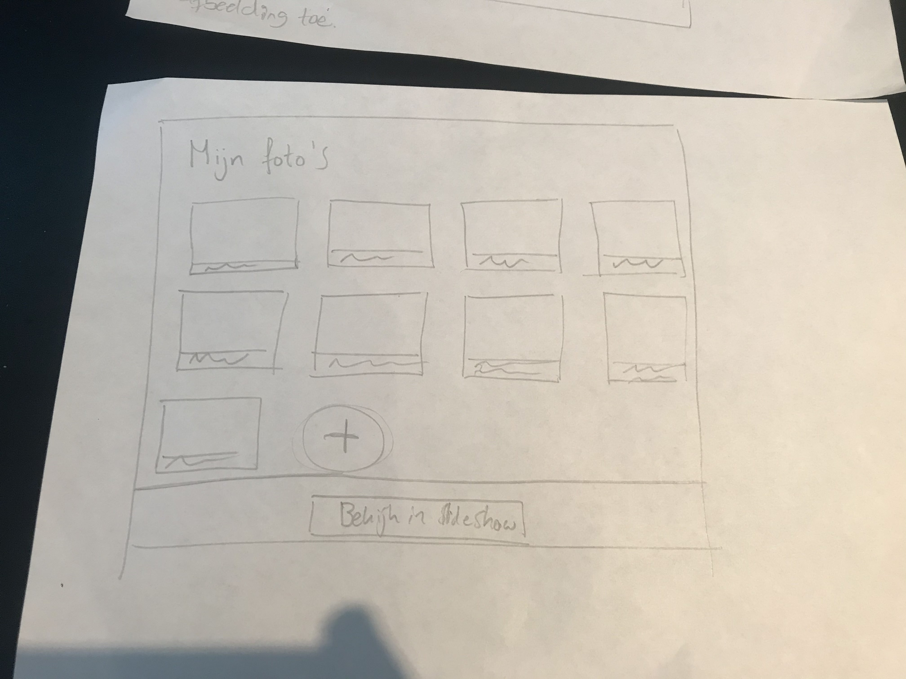
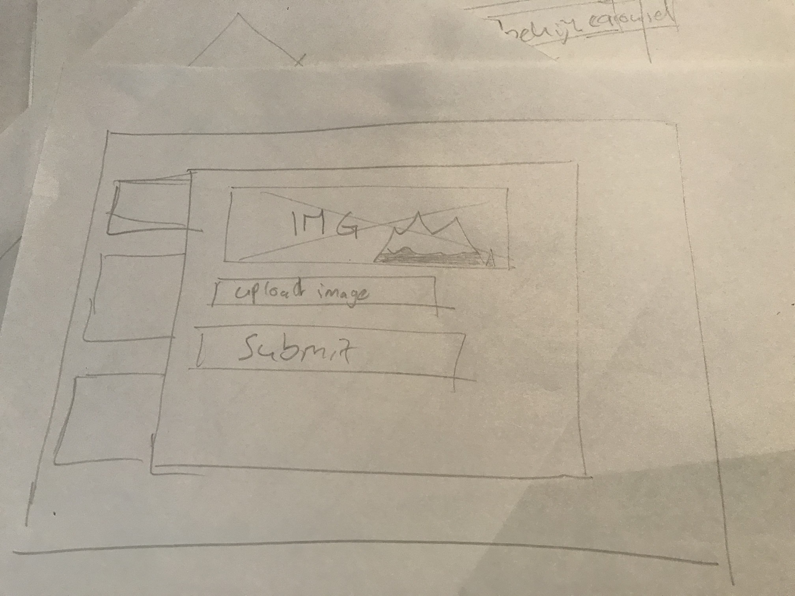
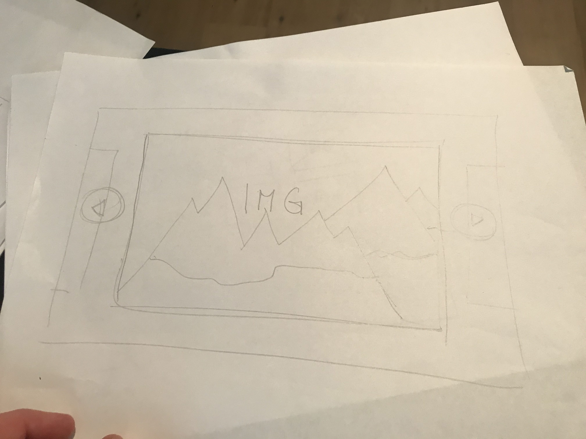

# Browser technologies

## Table of contents
1. [Live demo](#live-demo)
2. [Installation](#installation)
3. [Research](#research)

## Live demo
Check out my live demo on my server: [bt.gijsbertcharles.com](https://bt.gijsbertcharles.com)

## Installation
Clone this repo
```bash
git clone https://github.com/gijslaarman/browser-technologies-1920.git
```

Change directory to server directory:
```shell
cd browser-technologies-1920/server
```

Install dependencies:
```shell
npm install
```

Creating a .env environment:
```shell
touch .env
```
And fill in the following things: (This is mongodb server)
```env
DB_URL=<your_db_url>
DB_PORT=<your_db_port>
PORT=<your_server_port>
```

Scripts for running:
```shell
'npm run dev' // Testing environment, detects server changes.
'npm start' // production environment.
```

Enjoy!

## Research
I've done research on testing two subjects:
- Color / color blindness
- Not using any cookies

Check it out [here](research/Ppdracht1.1.md)

And tested out my own previously hacked prototype, you can see the results [here](research/Opdracht1.2.md)

### Wireframes
Lo-fi




This gave me a global idea of how I wanted to achieve the goal. Since there's a lot of room for my own ideas and how to do stuff I decided that as I would code I would make my decisions (Not just being lazy but also to gain more experience on the progressive enhancement stuff, since I knew I would have to rewrite a lot of parts).

## Features
- In HTML you can upload, delete and select the images you want to show in the carousel. The carousel itself does not work vertically, but there's no otherway.
- In CSS the carousel works, and you can scroll through the carousel without Javascript being used. It's not fancy and the user experience isn't optimal but it works.
- With javascript you can flick through the images with the keyboard buttons & the buttons are fixed so you can easily scroll through. I would have liked to be able to drag the carousel with your finger, but I didn't figure that out would need more time to do that.

## Fallbacks
- If the user has no javascript enabled then the user can still scroll through the carousel with buttons. Using the <noscript> tag the browser detects if the buttons per image should be visible.