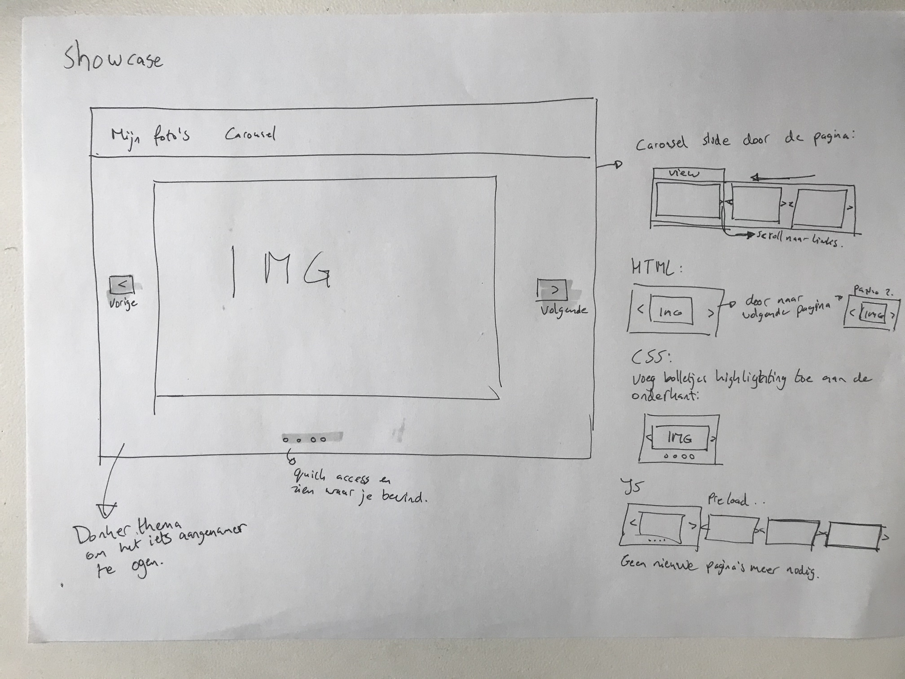

# Browser technologies

## Table of contents
1. [Live demo](#live-demo)
2. [Installation](#installation)
3. [Research](#research)
4. [To do's](#to-dos)
4. [Conclusion](#conclusion)

## Live demo
Check out my live demo on my server: [bt.gijsbertcharles.com](https://bt.gijsbertcharles.com)

## Installation
Clone this repo
```bash
git clone https://github.com/gijslaarman/browser-technologies-1920.git
```

Change directory to server directory:
```shell
cd browser-technologies-1920/server
```

Install dependencies:
```shell
npm install
```

Creating a .env environment:
```shell
touch .env
```
And fill in the following things: (This is mongodb server)
```env
DB_URL=<your_db_url>
DB_PORT=<your_db_port>
PORT=<your_server_port>
```

Scripts for running:
```shell
'npm run dev' // Testing environment, detects server changes.
'npm start' // production environment.
```

Enjoy!

## Research
I've done research on testing two subjects:
- Color / color blindness
- Not using any cookies

Check it out [here](research/Ppdracht1.1.md)

And tested out my own previously hacked prototype, you can see the results [here](research/Opdracht1.2.md)


## The Case
I want to be able to upload my vacation photo's on a website and be able to select the images I want to showcase in a carousel. I want the page to remember my selection for next time.

### Wireframes
Lo-fi

Let's work that out into something a bit more understandable.

Hi-fi(er)




This gave me a global idea of how I wanted to achieve the goal. Since there's a lot of room for my own ideas and how to do stuff I decided that as I would code I would make my decisions (Not just being lazy but also to gain more experience on the progressive enhancement stuff, since I knew I would have to rewrite a lot of parts).

## Progressive enhancement
- In HTML you can upload, delete and select the images you want to show in the carousel. Only the carousel itself doesn't work.
I should have split up the images per page where you can navigate easily through the pages with links.
> I lost track here of the progressive enhancement, basically I had in mind that css works 99% of the time so it wouldn't be an issue.

#### Example
1. HTML

2. CSS

3. JS


- In CSS the carousel works, and you can scroll through the carousel without Javascript being used. It's not fancy and the user experience isn't optimal but it works.

- With javascript you can flick through the images with the keyboard buttons & the buttons are fixed so you can easily scroll through. I would have liked to be able to drag the carousel with your finger, but I didn't figure that out would need more time to do that.

## Feature detection
- If the user has no javascript enabled then the user can still scroll through the carousel with buttons. Using the \<noscript> tag the browser detects if the buttons per image should be visible.
- HTML is serverside rendered. So users are not left out of content. But as stated before HTML only is far from optimal, but it works.
- The "add image" form is positioned at the bottom of the page. But when javascript is enabled the form disappears and a "+" button appears right after the image rows. If you click that the form pops up as an overlay. Thought it would be easier to spot/understand, than having to search through the page, since it's a well known pattern currently.
- _Decided that scroll-snap would be too much of a hassle, but I would have used a `@supports(scroll-snap)` in css if I went through with that. But decided that another option would be easier and better._

#### Could be features & their fallbacks:
- With javascript enabled the user can select their carousel selection without having to click "save selection".
- Reduce the two pages to one, UX wise it's horrible. But that's what HTML/CSS only permits. So if javascript is enabled it's easy to merge the two pages together. The fallback would still be the two pages.

## Browser support
Tested on these browsers currently have no issues (nor css defects) Windows & Mac:
- Chrome (version: 28+)
- Firefox (version: 28+)
- Safari (version: 7+)
- Edge (all versions)

(Did not, and was not able to test on Internet Explorer).

--- 

Submit an [issue](https://github.com/gijslaarman/browser-technologies-1920/issues/new) if you find any bugs, state the OS, Browser & version.

> I'm going to be honest, the site isn't complex enough on the frontend for it to really have any troubles. I used conventions already supported by every browser except internet explorer, but nobody is going to use internet explorer on their own personal devices, because in this case it's personal use (personal gallery). (Internet explorer is not even in the Windows OS package anymore.)

## To do's
- [ ] Split up the carousel into 1 image per page. And progressive enhance the swiping through by handling the next image with Javascript.
- [ ] Save selection without having to click save selection.
- [ ] If javascript is enabled the carousel & overview pages can be merged. But has to be seperate to keep it working on HTML/CSS only.
- [ ] If CSS supports scroll-snapping use that. If not (how do I check that?) fall back to the javascript version.

## Conclusion
Once has to be a first time. And that definitely applied to this project. Normally I just go deep into the prototyping and create stuff, without thinking about the problems that could occur. Stuff like no javascript what if the connection is super slow and even the css is not recieved. 
Well then the user still needs to be able to make use of your website is the progressive enhancement way.

#### Sketching
I started out with a couple rough sketches, to get an idea of what is needed to achieve the goal:
> Create an experience where you can upload vacation pictures and (select them to) showcase them in a carousel.

#### HTML
So done some drawing, now it's time to turn it into a website. Since we're building from the ground up (HTML > CSS > JS) I started off with HTML. I added the forms, rendering in the images with the ability to select them and delete them. 

>Halfway I had to add the "select your selection" part, because that was unclear to me. So change of plans a bit.

For some reason the form inside a form thing doesn't work when rendering with some browsers. That's where I split up the forms into two seperate pages. I really didn't like that UX-wise but it had to be done to make it work.

#### CSS
Decided to add some paint to the project when the HTML wasn't fully finished yet. A mistake.. I heard in a presentation that the chance of no CSS is so low that you probably don't even have to keep it into consideration. Guess that's where I went wrong and thought let's go CSS from now on.

The carousel started out with using the [CSS scroll-snap](https://caniuse.com/#feat=css-snappoints) functions. It made the scrolling through the carousel easy, but it had some downsides:

- The support for browsers wasn't great.
- The controls weren't very customizable. You could use the arrow keys to scroll through it. But I couldn't really figure out how to create next/previous buttons.

So I skipped that and added some next/previous buttons to cycle through the images & dots underin the screen. With the `:target` css-selector I handled the position of the carousel on the page.

_In hindsight: I wouldn't have a clue how to handle off this progressive enhancement when CSS is enabled that you still have the carousel experience (sidewards scrolling). And without CSS that you can navigate through pages as carousel. Only option would be don't have different pages in HTML or do have to navigate throught pages with CSS. 
Then javascript can handle the preloading and smooth scrolling._

#### Javascript
Even though it looks like graceful degradation I did not do that. I did however try to hack CSS as much as possible (ignoring conventions). One thing I used was the \<noscript> tag to remove previous/next buttons when there is javascript. I added that after adding the javascript because I needed to find a way to remove those buttons and replace them with a javascript handled previous/next buttons. 

#### All in all
Next time I would do this a lot different. I would create the whole app with HTML only first, I really lost track and made myself a big mess eventually. Going back and forth in the end between HTML/CSS & javascript. If the HTML would be more solid the CSS would have been super easy & javascript would have actually enhanced it. Thing for the future. 

Doesn't take away that what I made is not progressive enhanced/graceful degredated. I did the research on what I can and cannot use and tried to keep it simple.

##### Core functionalities
Works as intended, the UX is a bit lacking but it does work on every modern browser.

##### Accessability
No CSS fallbacks needed. The forms and selection are usable with the keyboard. The carousel is navigatable with the arrow keys, the dots at the bottom of the page and the next/previous buttons with and without javascript.

##### Feature detection
The ability to detect if a feature is available by the browser. [See this chapter for my features.](#feature-detection).