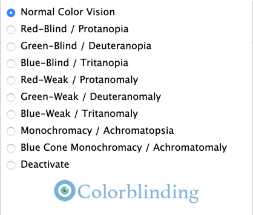
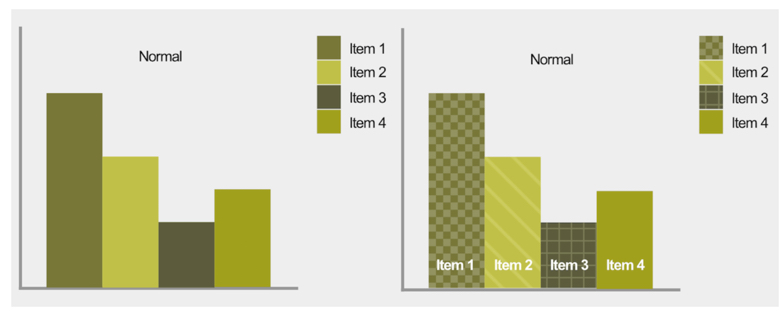

# Opdracht 1.1: 'Breek het web'
### Geen kleur / Kleuren blind
- Ongeveer 4% van de bevolking is kleuren blind. 

#### Hoe test je dit

<a href="https://chrome.google.com/webstore/detail/colorblinding/dgbgleaofjainknadoffbjkclicbbgaa">Colorblinding</a>

Met deze tool kan je instellen in je browser welk filter je wilt toepassen voor de websites:

#### Case: [Close website](https://thecloseapp.com)

> Een voorbeeld van alle 9 verschillende type kleurenblind toegepast op deze website.

#### Opmerkingen
Veel websites gaan de test aardig goed af. Af en toe valt er hier en daar wat hiërarchie weg maar dat is te begrijpen. Niks is echt vreemd en er valt ook geen tekst onleesbaar weg.

### Tips
- Gebruik zowel kleur als symbolen: je bericht moet duidelijk zijn met als zonder kleur. Voorbeeld: 

> Het rood wordt niet altijd als rood geïnterpreteerd door mensen met kleuren blind. Daarom is een symbool handig om te laten zien dat er actie is vereist.
- Gebruik niet teveel kleuren: Zo houd je het contrast hoog en voorkom je irritatie.
- Gebruik patronen en 'textures' om verschil aan te duiden hier onder is een goed voorbeeld waar dat heel noodzakelijk is: 

- Let goed op de contrasten van je kleuren, zorg dat de contrasten altijd goed zichtbaar blijven. Zwart & wit hoeven niet de enige contrasten te zijn. 

> Wordfeud heeft de verschillende kleuren zo gekozen dat voor elke kleurenblindheid er contrast in zit.

Sources:
https://usabilla.com/blog/how-to-design-for-color-blindness/