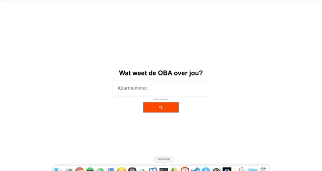
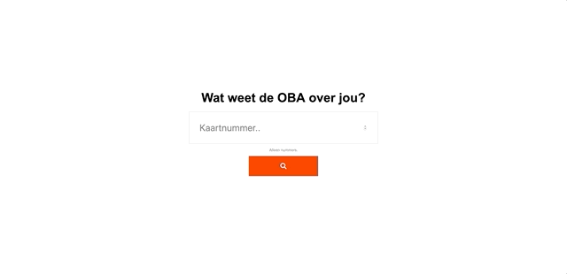
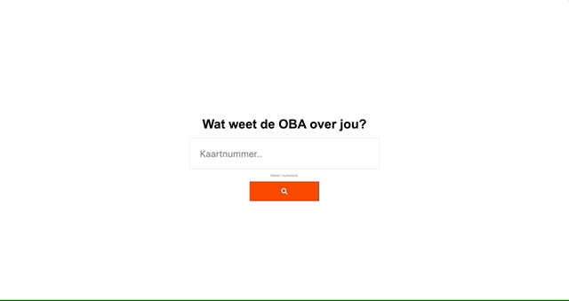
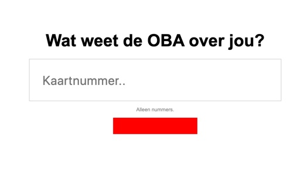
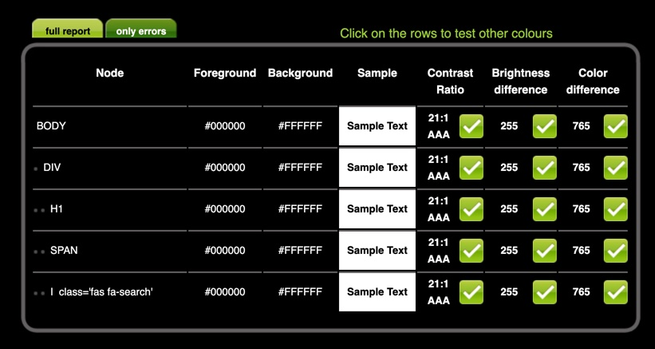

# Testen van OBA 
### [Link to the project I'm testing](https://github.com/gijslaarman/project-1-1920)

## Table of contents
- [Testing on devices](#testing-on-devices)
- [Testing on browsers](#testing-on-browsers)
- [Extra tests](#extra-tests)

## Testing on devices

### iPod touch (4th generation)
- Ios version: 6.0.1 (10A523)
- Browser: Safari 

```
Mozilla/5.0 (iPod; CPU iPhone OS 6_0_1 like Mac OS X) AppleWebKit/536.26 (KHTML, like Gecko) Version/6.0 Mobile/10A523 Safari/8536.25
```

#### Foundings
1. The CSS is fine, but I couldn't fully test if it worked since I never could see a detailpage.
1. Interaction did not work, the javascript didn't fire. There is a preventDefault set on the form submit, yet this does not work. 

#### Solution
There are two ways to fix the javascript not being used:
1. Use [Babel](https://babeljs.io/) to maybe fix the javascript and set it over to more browser compatibility.
2. _Better option_, Handle the submit server side, and return HTML.

### iPad 
- Ios version: 11.3
- Browser: Safari

```
Mozilla/5.0 (iPad; CPU OS 11_3 like Mac OS X) AppleWebKit/605.1.15 (KHTML, like Gecko) Version/11.0 Mobile/15E148 Safari/604.1
```

#### Foundings
1. It's a quite newish device
2. The javascript doesn't work: I know now it's because it's split up in modules which is terribly supported.

#### Solution

### Revolution (?) 
- Unknown android phone
- Android version: 4.4.4
- Browser: Revolution browser & Chrome browser

```
Mozilla/5.0 (Linux; Android 4.4.4; revolution Build/KTU84Q)AppleWebKit/537.36 (KHTML, like Gecko) Version/4.0 Chrome 33.0.0.0 Mobile Safari/537.35
```

#### Foundings
1. Same as the others 
1. Interaction did not work, the javascript didn't fire same problem. On Chrome it did work, probably up-to-date to support modules.

#### Solution
There are two ways to fix the javascript not being used:
1. Use [Babel](https://babeljs.io/) to minify and make the javascript into one file.

## Testing on browsers
So before I show the results per browser, we know the current issue occurs because of modern javascript. The mobile browsers can't understand the script being split up in modules. However the most modern browsers do support this. So I was not at all shocked by the result. 

### Chrome


### Firefox


### Brave


## Extra tests

### Disabling javascript
Easy as. Just doesn't work. The solution is "easy", make a fallback that when javascript doesn't load the submit gets handled serverside and you get redirected to a new page.

### Custom fonts
FontAwesome breaks, so the icon on the search button will be gone. Basically breaking the button because it has no indication of what the square does. A reasonable solution would be to use an SVG in there. But does that solve it for blind users?



### Being color blind
No issues here either. Mainly used black & white, with one red button, but the contrast is suffecient. Here is the score done by [Check my colours](https://checkmycolours.com):



### Mouse/trackpad not working.
There's only one input field that is semantically correct, also because I reeeaally want it that way. If I fill in a form I want to type and be able to press enter! (Seriously a lot of my peers don't do this it's infuriating).

So on page load:
1. Press tab, get directed to input field
2. Type a number
3. Press enter
4. **Profit!**

### No broadband internet
On first page load:

> Yeh not good.

Let's be honest <400kb isn't that bad. Although fetching the pictures for each book is definitely going to be a bottleneck.

Some fixes:
- Don't load in FontAwesome's CDN (I was lazy + didn't have a lot of time).
- Minify the javascript into one file, so it doesn't have to make individual requests.

### No cookies
Website doesn't use cookies.

### No images
Only the books use images. But they don't have alt texts. They do have meta data per article, that contain a lot of the data of the book cover.

### Screenreader
I made a very huge error that is easily fixable. In the HTML tag I set the `lang="en"` attribute. It's a dutch site, so the screenreader is trying it's very best to talk dutch in a very robotic American voice 👍.

- Set `lang="nl"`

The website doesn't have enough content to test if the screenreader really has any issues flow wise etc.